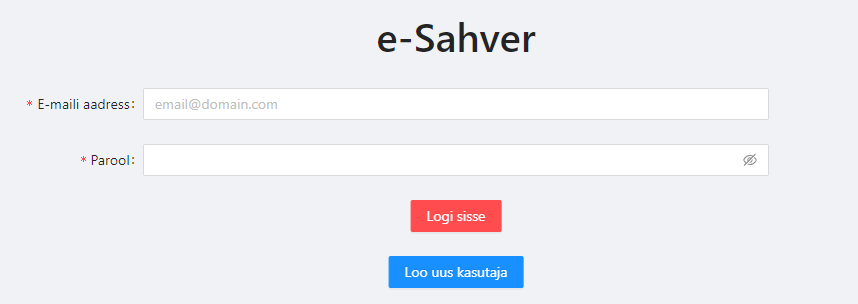
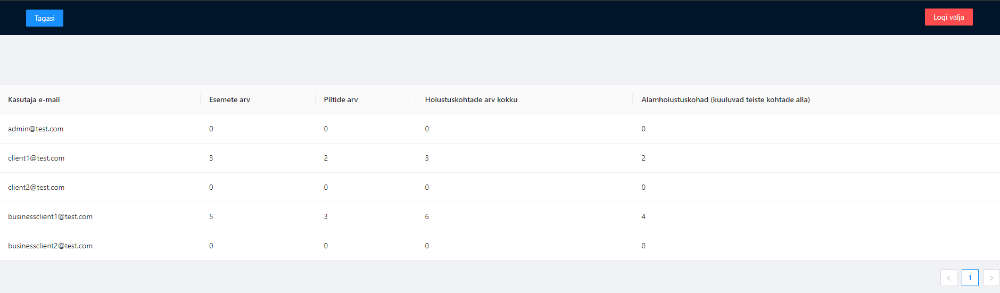
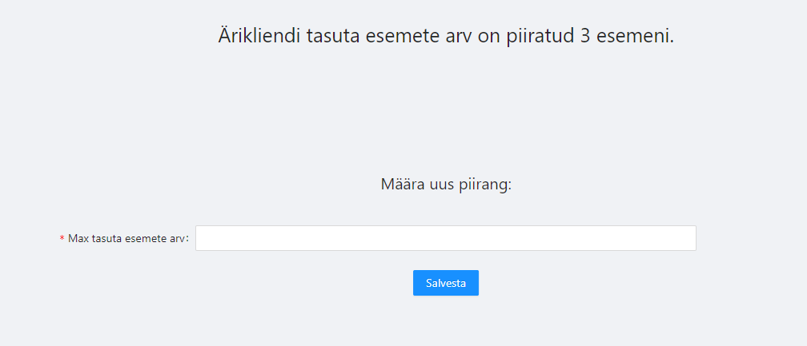
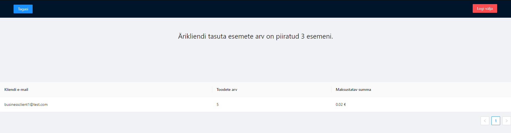
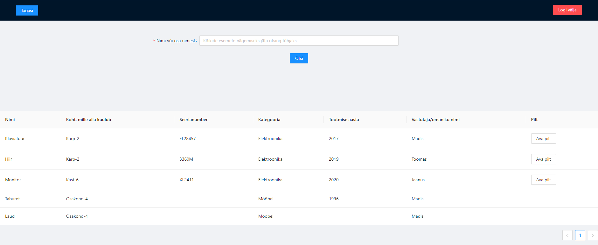
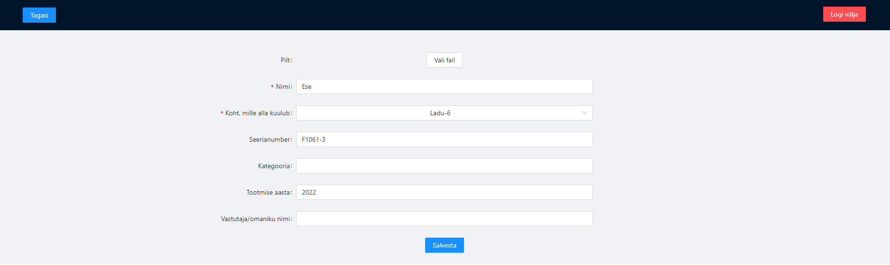
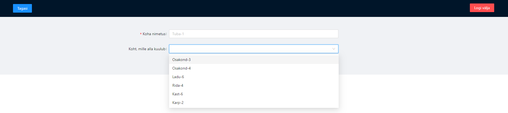

# e-Sahver, lihtne laosüsteemi rakendus

## Lühikirjeldus

Rakendus, kuhu märkida üles kõik oma esemed hoiustamiskohtade kaupa. Loo kasutaja, seejärel loo hoiustamiskohad. Saad neid ka üksteise sisse põimida, näiteks Ladu-5, mille all on Ruum-2, mille all on Kapp-1 jne. Hoiustamiskohtade alla saad hakata lisama esemeid koos nime, pildi ja muude parameetritega, nagu näiteks seerianumber või tootmise aasta. Seejärel on võimalik esemeid nime järgi paindlikult otsida ning näha kõiki parameetreid koos fotoga.
Võimalik on luua ka ärikliendi konto, millele admin konto saab määrata tasuta esemete piirangu - seda ületades tuleb maksta 1 sent eseme kohta. Admin paneelist on võimalik näha piiranguid ületavaid ärikliente koos makstava summaga ning samuti piirangut muuta. Lisaks näeb kõikide kasutajate kohta statistikat, näiteks kui palju on kellegil hoiustamiskohti, esemeid, pilte jne.

## Funktsionaalsuste kokkuvõte

- Sisselogimine ja registreerimine (tavaklient või äriklient, admin on eeldefineeritud)
- Hoiustamiskohtade piiramatu üksteise sisse loomine
- Esemete salvestamine koos parameetritega (pilt, nimi, seerianumber jne)
- Esemete otsing
- Ärikliendile tasuta esemete piirangu määramine
- Piiranguid ületavate äriklientide koondvaade koos summaga
- Statistika kõikide kasutajate kohta

## Kasutatud tehnoloogiad

- Spring Boot (Gradle)
- React
- PostgreSQL
- Docker

## Installeerimisjuhis

**Rakendus vajab npm ja Docker Engine olemasolu.**
Esmalt klooni projekt sobivasse kohta ```git clone``` käsuga. Seejärel installi frontend dependencyd:
```sh
cd frontend
npm i
```
Liigu tagasi projekti root kataloogi ja käivita konteinerid (**Docker Engine peab töötama**):
```sh
cd ..
docker-compose up
```
Kui kõik läks hästi, siis on rakendus kättesaadav aadressil http://localhost:3000/

## Lisad

- Backend käivitub koos testandmetega, millega on võimalik tutvuda BackendApplication.java failis
- Ant Design
- Swagger (http://localhost:8080/swagger-ui/)
- Backend kaetud unit testidega

## Teadaolevad puudused ja vead

- Kõik APId täielikult kaitsmata
- Sisselogitud kasutaja logitakse brauseri refreshimisel välja

## Pildid

- Sisselogimine

- Kasutajate statistika admin paneelis

- Ärikliendi piirangute muutmine admin paneelis

- Piiranguid ületavate äriklientide nägemine admin paneelis

- Lisatud esemete otsimine

- Esemete lisamine

- Hoiustuskohtade lisamine
